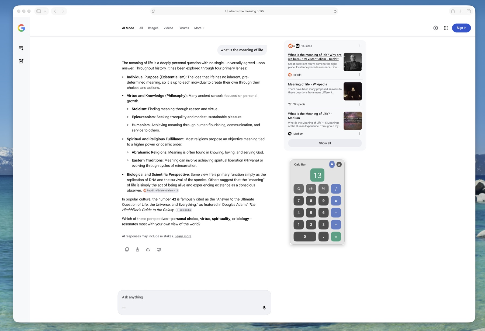
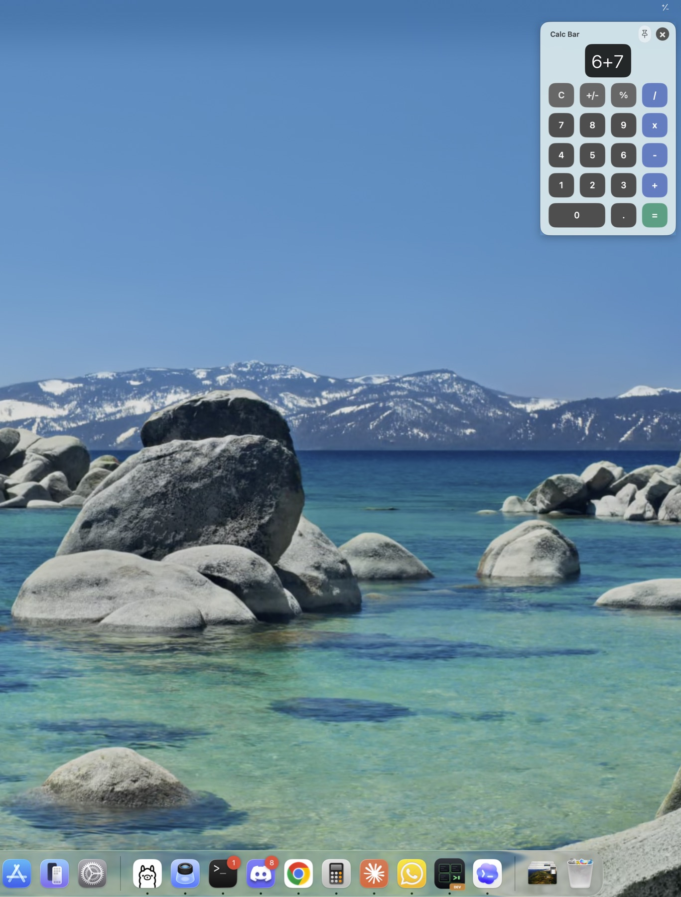

# Calc Bar

A tiny macOS menu bar calculator for people who keep reaching for the built-in Calculator app and thinking: this is not quite what I wanted.

Calc Bar opens with a global hotkey, accepts real numpad input, can stay pinned above other apps, and keeps the calculation visible as you type.





## What It Does

- Lives in the macOS menu bar with no Dock icon.
- Opens and closes with `Option + C`.
- Works with the number row and numeric keypad.
- Shows expressions as you type, like `5+5`, then shows the result after `Enter`.
- Turns the output box green when a calculation is complete.
- Can be pinned so it stays above other windows and apps.
- Can be dragged around the screen when pinned.

## Install

Calc Bar isn't notarized — there's no paid Apple Developer account behind it — so a freshly downloaded copy trips Gatekeeper on first launch. Any of the routes below gets you running. Once it's installed, press `Option + C` to summon the calculator.

### One line (recommended)

Downloads the latest release, clears the quarantine flag and installs it to your Applications folder:

```sh
curl -fsSL https://raw.githubusercontent.com/Samuel-Tucker/Calc-Bar/main/Scripts/install.sh | bash
```

### Manual download

1. Download `Calc-Bar-x.y.z-macos.zip` from the [latest release](https://github.com/Samuel-Tucker/Calc-Bar/releases/latest) and unzip it.
2. Move `Calc Bar.app` to `/Applications`.
3. Clear the quarantine flag, then open it normally:

   ```sh
   xattr -dr com.apple.quarantine "/Applications/Calc Bar.app"
   ```

   On macOS Sequoia and later there's no right-click → Open shortcut any more, so if you skip that command you'll instead have to open **System Settings → Privacy & Security** and click **Open Anyway** after the first launch is blocked.

### Build from source

No Gatekeeper prompts at all — locally built apps are never quarantined. Needs the Swift toolchain (Xcode or the Command Line Tools):

```sh
git clone https://github.com/Samuel-Tucker/Calc-Bar.git
cd Calc-Bar
swift run CalcBar          # run it straight away
Scripts/build-app.sh       # or build a .app bundle into .build/
open ".build/Calc Bar.app"
```

The built bundle is ad-hoc signed with `codesign --sign -`. That's fine for your own machine, but it isn't notarized, so copies you send to other Macs still need one of the steps above.

## Controls

Open the calculator and click `Calc Bar ▾` in the header for the built-in cheat sheet.

| Action | Shortcut |
| --- | --- |
| Open / close | `Option + C` |
| Close panel | `Esc` or `×` |
| Keep on top | Pin button |
| Move pinned calculator | Drag the panel |
| Digits | `0-9` or numeric keypad |
| Operators | `+`, `-`, `x`, `/` |
| Calculate | `Enter`, `Return`, or `=` |
| Clear | `C` or `Delete` |

## Development

Requirements:

- macOS
- Swift toolchain
- Xcode or Apple Command Line Tools

Useful commands:

```sh
swift build
swift run CalcBar
Scripts/build-app.sh
Scripts/package-release.sh 0.1.0
```

Package a GitHub Release zip:

```sh
Scripts/package-release.sh 0.1.0
```

That writes:

```text
.build/dist/Calc-Bar-0.1.0-macos.zip
.build/dist/Calc-Bar-0.1.0-macos.zip.sha256
```

Regenerate the app icon after changing `Scripts/generate-icon.swift`:

```sh
swift Scripts/generate-icon.swift
iconutil -c icns Resources/AppIcon.iconset -o Resources/CalcBar.icns
```

If you want to reset the built app:

```sh
pkill -x CalcBar
Scripts/build-app.sh
open ".build/Calc Bar.app"
```

## Project Structure

```text
Package.swift
Info.plist
Scripts/build-app.sh
Sources/CalcBar/
  AppDelegate.swift
  CalculatorEngine.swift
  CalculatorPanelController.swift
  GlobalHotKey.swift
  KeyCode.swift
  main.swift
Resources/
  CalcBar.icns
  AppIcon.iconset/
```

## Forking Notes

This is intentionally small and boring Swift/AppKit. Fork it, change the layout, swap the hotkey, add themes, or turn it into the calculator macOS should have shipped with.

Things worth improving:

- Preferences for custom hotkeys.
- Light/dark themes.
- Calculation history.
- Developer ID signing and notarization.
- A Homebrew cask once release zips are published.

## Distribution Notes

You can publish release zips without an Apple Developer account:

```sh
Scripts/package-release.sh 0.1.0
```

That writes `Calc-Bar-0.1.0-macos.zip` (plus a `.sha256`) to `.build/dist/`. Attach both to a GitHub Release:

```sh
gh release create v0.1.0 \
  .build/dist/Calc-Bar-0.1.0-macos.zip \
  .build/dist/Calc-Bar-0.1.0-macos.zip.sha256 \
  --title "Calc Bar 0.1.0" --generate-notes
```

`Scripts/install.sh` always pulls the **latest** release, so the one-line installer in [Install](#install) starts working as soon as a release exists, and keeps pointing at the newest one.

Without an Apple Developer account the app can be ad-hoc signed but not Developer ID signed or notarized — hence the quarantine-clearing step the installer does for users. The checksum file lets `install.sh` verify the download before it touches Applications.

## License

MIT. See [LICENSE](LICENSE).
